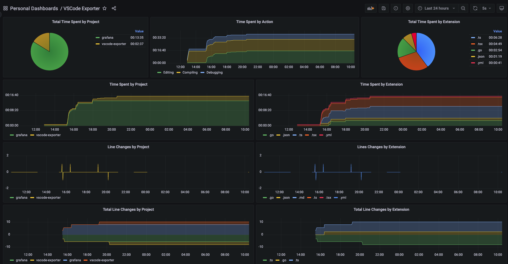

# vscode-exporter

Prometheus exporter for VSCode metrics using [prom-client](https://github.com/siimon/prom-client).

[](https://guicaulada.grafana.net/public-dashboards/e00f2ad838544b02826e8c075c05df45?orgId=1&refresh=30s)

## Features

This extension exposes the following custom metrics on the `/metrics` endpoint:

```text
vscode_debug_seconds_total{id, name, type, folder} counter
vscode_debug_seconds_active{id, name, type, folder} counter
vscode_debug_sessions_active{id, name, type, folder} gauge
vscode_breakpoints_enabled{session id, name, type, folder} gauge
vscode_breakpoints_active{session id, name, type, folder} gauge
vscode_debug_custom_events{id, name, type, folder} counter
vscode_tasks_seconds_total{name, type, is_background} counter
vscode_tasks_activesks {name, type, is_background} gauge
vscode_tasks_process_active{name, type, is_background} gauge
vscode_tasks_process_total{name, type, if is background, exit code} counter
vscode_notebooks_seconds_active{project, folder, file, type, is_untitled} counter
vscode_notebooks_cells {project, folder, file, type, is_untitled} gauge
vscode_terminals_seconds_total{name, exit code} counter
vscode_terminals_seconds_active{name, exit code} counter
vscode_terminals_active {name} gauge
vscode_editor_seconds_active{project, folder, file, language, is_untitled} counter
vscode_characters_total{project, folder, file, language, is_untitled} gauge
vscode_lines_totales {project, folder, file, language, is_untitled} gauge
vscode_editors_edits_total{project, folder, file, language, is_untitled} counter
vscode_notebooks_edits_total{project, folder, file, language, is_untitled} counter
vscode_notebooks_visible{project, folder, file, type, is_untitled} gauge
vscode_editors_visible{project, folder, file, language, is_untitled} gauge
vscode_seconds_active {focused} counter
vscode_notebooks_content_changes_total{project, folder, file, type, is_untitled} counter
vscode_notebooks_cell_changes_total{project, folder, file, type, is_untitled} counter
vscode_editors_content_changes_total{project, folder, file, language, is_untitled} counter
vscode_workspace_folders_added{project, folder, name} counter
vscode_workspace_folders_removed{project, folder, name} counter
vscode_workspace_notebooks_closed{project, folder, file, type, is_untitled} counter
vscode_workspace_documents_closed{project, folder, file, language, is_untitled} counter
vscode_workspace_files_added{project, folder, name} counter
vscode_workspace_files_removed{project, folder, name} counter
vscode_workspace_trust_grants{project} counter
vscode_workspace_notebooks_opened{project, folder, file, type, is_untitled} counter
vscode_workspace_documents_opened{project, folder, file, language, is_untitled} counter
vscode_workspace_files_renamed{project, folder, name} counter
vscode_workspace_notebooks_saved{project, folder, file, type, is_untitled} counter
vscode_workspace_documents_saved{project, folder, file, language, is_untitled} counter
```

All the default metrics recommended by Prometheus [itself](https://prometheus.io/docs/instrumenting/writing_clientlibs/#standard-and-runtime-collectors) for Node.js are also exposed.

## Extension Settings

This extension contributes the following settings:

* `VSCodeExporter.port`: Port to expose metrics on (default: 9931).
* `VSCodeExporter.debug`: Enable debug logs (default: false).

## Extension Commands

This extension contributes the following commands:

* `vscode-exporter.open`: Opens the metrics endpoint on your browser.

**All recommendations, issues and pull requests are welcome! Enjoy!**
